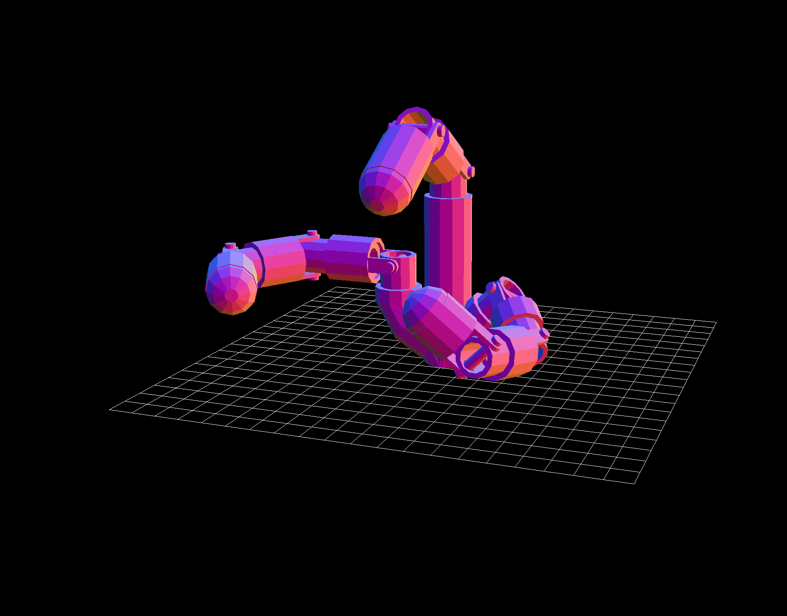

# Recent Projects

## Computational Robotic Design (Sung Robotics Lab)

  
  <button onclick="prevSlide(2)" style="position:absolute;top:50%;left:0;">❮</button>
  <button onclick="nextSlide(2)" style="position:absolute;top:50%;right:0;">❯</button>

[More](projects/robodesign.html)

## Rescue Bot
<iframe width="640" height="360" src="https://www.youtube.com/embed/cdshrarlcyE" frameborder="0" allowfullscreen> </iframe>

[More](projects/rescuebot.html)

## Hot Wheels Launcher
<iframe width="640" height="360" src="https://www.youtube.com/embed/c7rVqEytUR0" frameborder="0" allowfullscreen> </iframe>

[More](projects/hotwheels.html)

